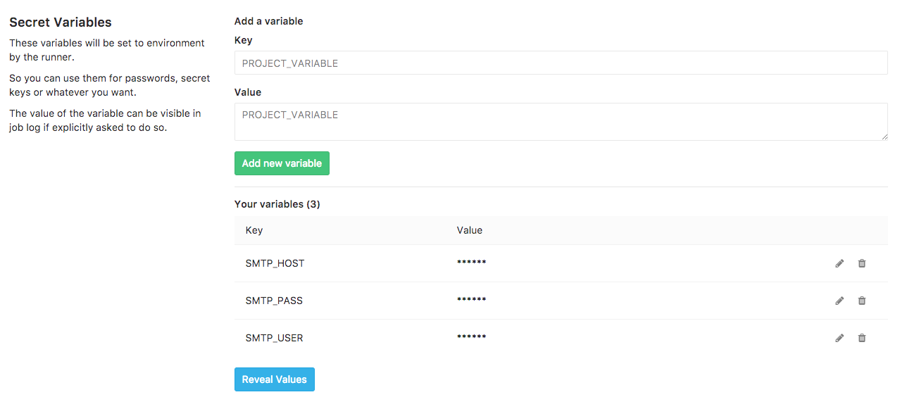
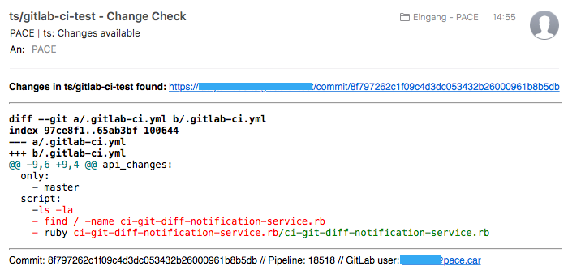

# GIT Diff Notification Service for GitLab

Notifies on changes for given git repository files with git-diff to given email adresses as HTML email.

## Getting Started

These instructions will get you a copy of the project up and running on your own GitLab instance.

### Installing

Switch to your GitLab project settings and add these variables to the **Secret Variables** section of the **CI/CD Pipelines** options page.

 - SMTP_HOST = `smtp.example.com`
 - SMTP_USER = `me@example.com`
 - SMTP_PASS = `Pa$$w0rd`
 - DIFF_MAIL = `someone@example.com,anybody@example.com`
 - DIFF_FILE = `file/to/watch.txt,.gitignore,otherfile/to.watch`

#### Example



Now, add this snippet to your repositories `.gitlab-ci.yml` file as another task

```
diff_notification:
  stage: build
  image: pacecar/docker-diff-notification-service:latest
  only:
    - master
  script:
    - ruby /ci-git-diff-notification-service.rb
```

## Screenshot



## Built With

* [aha - Ansi HTML Adapter](https://github.com/theZiz/aha)

## License

All files are subjects to the LGPL2+ or the MPL1.1 (Dual licensed).